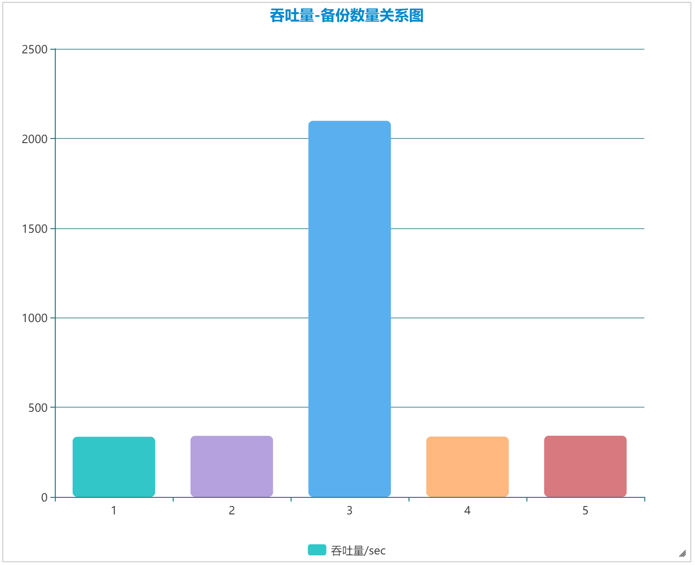
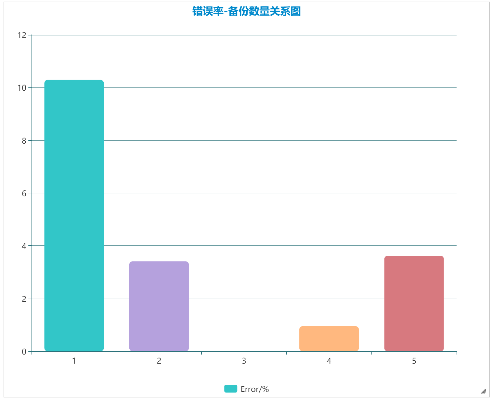
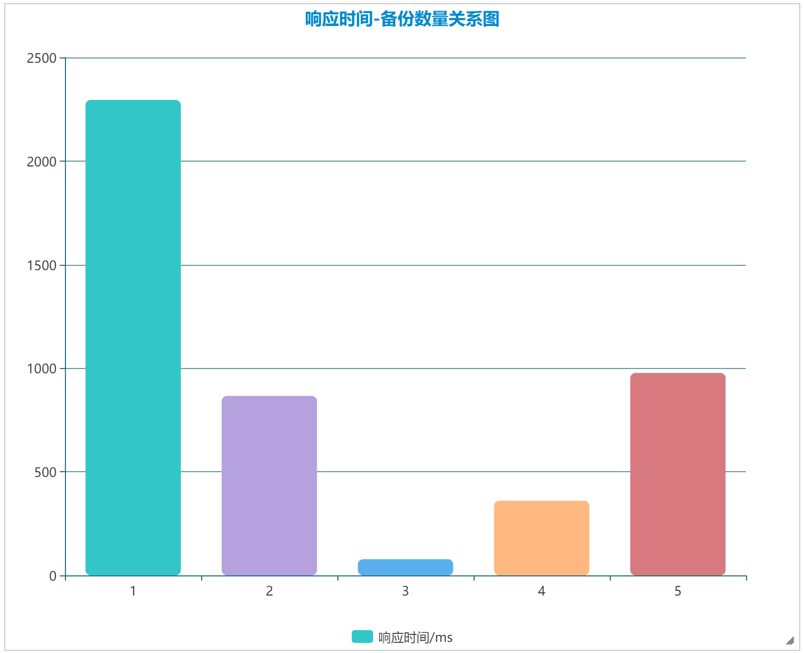

# Part 4. Load Balance & 性能测试报告

## 测试环境
- ubuntu 18.04 八核，4GB内存
- JMeter 5.0
- 应用包括前端、后端和数据库，前端对外暴露接口供测试访问

## 测试项目
- 以front-end replica的数量作为变量，测试其吞吐量、错误率等参数。
- replica数量取[1,2,3,4,5]。
- 线程参数：2000线程，循环2次
- 测试url：一个父url和一个子url，综合统计数据

## 测试结果
| 备份数量 | #Samples | Average | Error% | Throughput | Received KB/s | Send KB/s |
|-|-|-|-|-|-|-|
|1|8000|2295|10.29%|335.5/sec|321.28|37.56|
|2|8000|866|3.41%|340.7/sec|281.91|41.01|
|3|8000|78|0.00%|2098.1/sec|1600.20|261.24|
|4|8000|360|0.95%|336.7/sec|262.87|41.53|
|5|8000|977|3.62%|341.3/sec|283.73|40.98|

## 数据可视化与分析

### 吞吐量

可以发现吞吐量在备份数量为3的情况下性能最为突出，过多或过少的备份数量均对吞吐量有负面影响。
### 错误率

错误率也呈两头高中间低的趋势，在备份数量为3时达到最低。
### 平均响应时间

平均响应时间在备份数量为3时到达最短。
### 总结
备份数量并不是越多性能越好，部署于负载均衡内的备份数量应该控制在一个合适的范围，以达到性能的优化目的。

